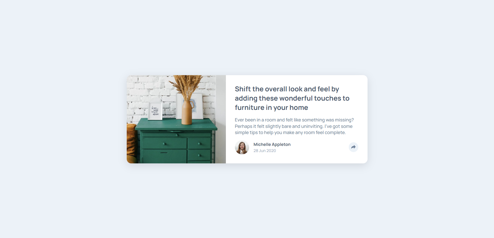
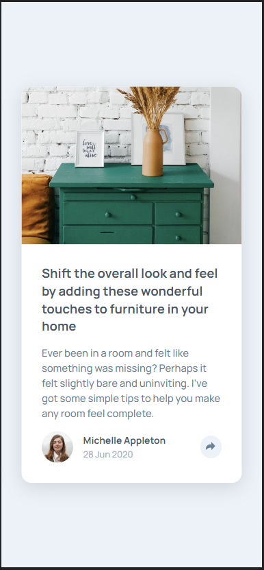

# Frontend Mentor - Article preview component solution

This is a solution to the [Article preview component challenge on Frontend Mentor](https://www.frontendmentor.io/challenges/article-preview-component-dYBN_pYFT). Frontend Mentor challenges help you improve your coding skills by building realistic projects. 

**Note: Delete this note and update the table of contents based on what sections you keep.**

## Overview

### The challenge

Users should be able to:

- View the optimal layout for the component depending on their device's screen size
- See the social media share links when they click the share icon

### Screenshot

### Links

- Solution URL: [Solution URL here](https://www.frontendmentor.io/challenges/article-preview-component-dYBN_pYFT/hub)
- Live Site URL: [Live site URL here](https://unaygney.github.io/articlePreviewComponent/)

## My process

### Built with

- Semantic HTML5 markup
- CSS custom properties
- Flexbox
- Sass 

## Author

- Website - [Guney Unay](https://www.unaygney.com)
- Frontend Mentor - [@unaygney](https://www.frontendmentor.io/profile/unaygney)

